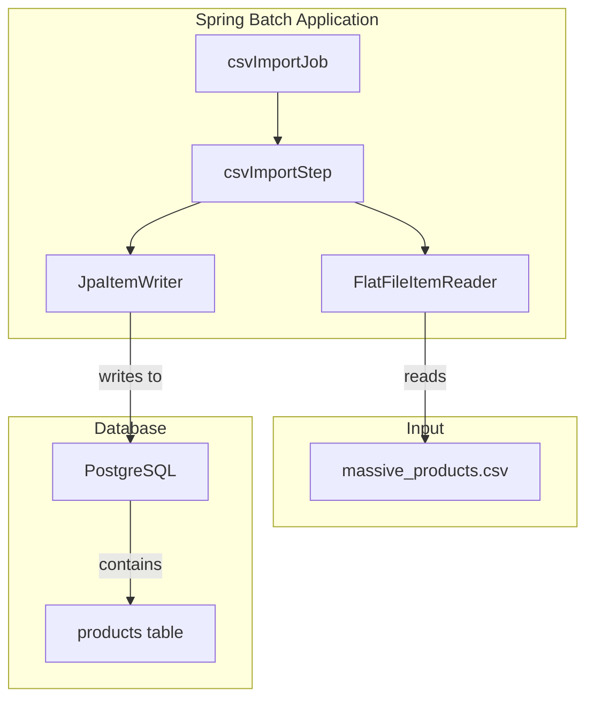

# Spring Batch CSV to PostgreSQL Importer

## Overview

This project is a Spring Boot application that demonstrates how to efficiently import large datasets from a CSV file into a PostgreSQL database using Spring Batch. It's a common scenario in data-driven applications where large amounts of data need to be processed and stored in a structured manner.

## The Problem

Imagine you have a very large CSV file containing millions of product records. Reading the entire file into memory and inserting the data row-by-row into a database would be inefficient and could lead to memory issues and slow performance. This project solves this problem by using Spring Batch to process the data in manageable chunks, providing a robust and scalable solution for batch processing.

## Solution Diagram

The following diagram illustrates the architecture of the solution:



## Technologies Used

*   **Java 17:** The programming language used for the project.
*   **Spring Boot:** Provides a fast and easy way to create stand-alone, production-grade Spring based Applications.
*   **Spring Batch:** A lightweight, comprehensive batch framework designed to enable the development of robust batch applications.
*   **Spring Data JPA:** Simplifies data access in a Spring application.
*   **PostgreSQL:** A powerful, open source object-relational database system.
*   **Flyway:** An open-source database migration tool.
*   **Lombok:** A Java library that automatically plugs into your editor and build tools to reduce boilerplate code.
*   **Gradle:** A build automation tool.
*   **Docker:** Used to containerize the PostgreSQL database for easy setup.

## Setup and Configuration

1.  **Prerequisites:**
    *   Java 17 or higher
    *   Docker and Docker Compose

2.  **Database Setup:**
    *   The project uses a PostgreSQL database, which can be easily started using Docker Compose:
        ```bash
        docker-compose up -d
        ```

3.  **Environment Variables:**
    *   The application uses environment variables to configure the database connection. You can either set them in your operating system or provide them when running the application.
    *   `DB_NAME`: The name of the database (e.g., `batcher`).
    *   `DB_USER`: The username for the database (e.g., `batcher`).
    *   `DB_PASSWORD`: The password for the database (e.g., `password`).

## How to Run

1.  **Using Gradle:**
    *   You can run the application using the Gradle wrapper. Make sure to provide the required environment variables.
        ```bash
        DB_NAME=batcher DB_USER=batcher DB_PASSWORD=password ./gradlew bootRun
        ```

2.  **From the JAR file:**
    *   First, build the application:
        ```bash
        ./gradlew build
        ```
    *   Then, run the generated JAR file:
        ```bash
        DB_NAME=batcher DB_USER=batcher DB_PASSWORD=password java -jar build/libs/batcher-0.0.1-SNAPSHOT.jar
        ```

## Triggering the Job

The batch job is not triggered automatically on startup. Instead, you can trigger it by sending a POST request to the `/launch` endpoint.

You can use `curl` to trigger the job:

```bash
curl -X POST http://localhost:8080/launch
```

This will start the `csvImportJob`.

## How to Run Tests

To run the tests, use the following command:

```bash
./gradlew test
```
